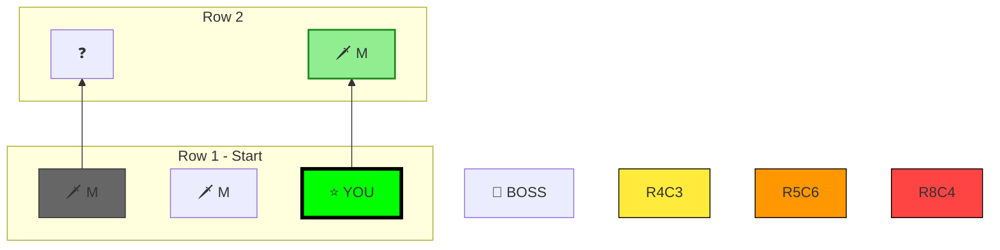

# Slay the Spire 2 Deck Advisor

Help players build optimal decks by tracking picks, suggesting cards, and identifying synergies.

## Reference Files

### Always Load (Universal)
These apply to ALL runs regardless of character:
- `references/strategy-guide.md` - Core strategy, act checkpoints, pathing, scaling concepts
- `references/ancient-boons.md` - All Ancient boons by act with tier ratings and notes
- `references/elites.md` - All 15 elites with HP, mechanics, and strategies by act
- `references/bosses.md` - All bosses by act with attack patterns and strategies
- `references/relics.csv` - All relics with effects (API data)
- `references/relics-tier-list.csv` - All relics with tier ratings, notes, and strategic evaluations
- `references/potions.csv` - All potions with effects
- `references/colorless-cards.csv` - Colorless cards available to all characters (API data)
- `references/colorless-tier-list.csv` - Colorless card tier ratings with strategic notes (from top player YouTube guide)
- `references/status-curse-cards.csv` - Status and Curse cards
- `references/token-cards.csv` - Token cards (created by other cards/relics)
- `references/event-ancient-cards.csv` - Event and Ancient boon cards
- `references/enchantments.csv` - All enchantments with effects
- `references/monsters.csv` - All monsters with HP and types
- `references/keywords.csv` - Keywords with descriptions (API source)
- `references/keywords.md` - Keywords, mechanics, buffs, debuffs, enchantments (detailed)
- `references/run-notes.md` - **Lessons learned from actual runs** (update after each run!)

### Character-Specific (Load Based on Active Run)
Only load the files for the character being played:

**Ironclad:**
- `references/ironclad-tier-list.csv` - Card tiers, energy, rarity, effects, strategic notes
- `references/ironclad-cards.csv` - Detailed card data (descriptions, keywords, upgrade info)
- `references/ironclad-archetypes.md` - Archetype breakdowns with YouTube guide summaries

**Silent:**
- `references/silent-tier-list.csv` - Card tiers, energy, rarity, effects, strategic notes
- `references/silent-cards.csv` - Detailed card data (descriptions, keywords, upgrade info)
- `references/silent-archetypes.md` - Archetype breakdowns (Sly/Discard, Poison, Shivs, Block/Control)

**Defect:**
- `references/defect-tier-list.csv` - Card tiers, energy, rarity, effects, strategic notes
- `references/defect-cards.csv` - Detailed card data (descriptions, keywords, upgrade info)
- `references/defect-archetypes.md` - Archetype breakdowns with YouTube guide summaries

**Necrobinder:**
- `references/necrobinder-tier-list.csv` - Card tiers, energy, rarity, effects, strategic notes
- `references/necrobinder-cards.csv` - Detailed card data (descriptions, keywords, upgrade info)
- `references/necrobinder-archetypes.md` - Archetype breakdowns with YouTube guide summaries

**Regent:**
- `references/regent-tier-list.csv` - Card tiers, energy, rarity, effects, strategic notes
- `references/regent-cards.csv` - Detailed card data (descriptions, keywords, upgrade info)
- `references/regent-archetypes.md` - Archetype breakdowns with YouTube guide summaries

**Note:** Archetype files include YouTube video references with timestamps and key insights from top players. Share video links when players want to learn more about specific strategies.

### Relic & Potion Images (for Shop/Screenshot Analysis)

**Relics:**
- `references/images/relics/` - PNG images of all 288 relics
- `references/images/relics/index.csv` - Maps relic names to image filenames

**Potions:**
- `references/images/potions/` - PNG images of all 63 potions
- `references/images/potions/index.csv` - Maps potion names to image filenames
- `references/potions-tier-list.csv` - Potion tiers with strategic notes

**When analyzing screenshots:**
1. User sends a screenshot (shop, combat, inventory)
2. **Load `references/visual-guide.md`** for icon identification help
3. Look at the relic/potion icons - use color, shape, and visual descriptions
4. Compare to the reference images if needed
5. Use tier list CSVs to provide ratings and recommendations

**Key visual reference:** `references/visual-guide.md` contains:
- Potions organized by color (green, blue, red, orange, purple, white)
- Relics organized by appearance (fruits, tools, jewelry, eggs, etc.)
- Common misidentification warnings (Meal Ticket vs Strawberry, etc.)
- Shop layout diagram

Images are named consistently (e.g., `ice_cream.png`, `fairy_in_a_bottle.png`) matching IDs in lowercase with underscores.

## Unknown Item Lookup (MANDATORY)

**If you don't recognize a card, relic, potion, keyword, or any game item:**

1. **ALWAYS search the reference files first** before saying "I don't have information":
```bash
# Search for a card/relic/item by name (case-insensitive)
grep -i "item_name" .claude/skills/slay-the-spire-2/references/*.csv

# Or search all files including markdown
grep -ri "item_name" .claude/skills/slay-the-spire-2/references/
```

2. **Check these files in order:**
   - `*-cards.csv` files for cards (character-specific or colorless)
   - `relics-tier-list.csv` for relics (includes tier + notes)
   - `relics.csv` for relic descriptions
   - `potions.csv` for potions
   - `enchantments.csv` for enchantments
   - `keywords.csv` or `keywords.md` for game terms
   - `monsters.csv` for enemies
   - `token-cards.csv` for generated cards
   - `event-ancient-cards.csv` for event/ancient cards
   - `status-curse-cards.csv` for status effects and curses

3. **If still not found**, the item may be:
   - New content not yet in the API
   - Misspelled (try partial match: `grep -i "partial"`)
   - A transformed/upgraded variant

4. **Never say "I don't have this in my database"** without searching first. The data is there — find it.

## Starting a Run

When user says "Start a [character] run":

1. Confirm the character (Ironclad, Silent, Defect, Necrobinder, Regent)
2. **Load ONLY that character's reference files** (tier list, archetypes if available)
3. Load universal references (strategy-guide.md, elites.md) as needed
4. Initialize deck tracking with starter cards
5. Explain early game focus: **survival and staying open**

### Starter Decks

**Ironclad (10 cards):**
```
Strike x5, Defend x4, Bash x1
```

**Silent (11 cards):**
```
Strike x5, Defend x4, Survivor x1, Neutralize x1
```
- Neutralize: 0 cost, 3 damage, apply 1 Weak
- Survivor: 1 cost, 8 block, discard a card (enables Sly synergies from turn 1)

**Defect (10 cards):**
```
Strike x4, Defend x4, Zap x1, Dualcast x1
```
- Zap: 1 cost, channel 1 Lightning (upgrade to 0 cost)
- Dualcast: 1 cost, evoke rightmost orb twice (upgrade to 0 cost)
- Starting Relic: Cracked Core (channel 1 Lightning at combat start)

**Necrobinder (10 cards):**
```
Strike x4, Defend x4, Unleash x1, Bodyguard x1
```
- Unleash: 1 cost, Osty deals damage equal to his HP (scales with Osty HP!)
- Bodyguard: 1 cost, Summon 5 (adds HP to Osty or revives him)
- Starting Relic: Osty's Binding (summons Osty at combat start)

**Regent (10 cards):**
```
Strike x4, Defend x4, Venerate x1, Following Star x1
```
- Venerate: 1 cost, gain 2 Stars (worse star gen, better options exist)
- Following Star: 0 cost, 2 Stars, deal 7 damage, apply Weak (actually good!)
- Starting Relic: Crown of Stars (gain 3 Stars at combat start)
- **Note:** Stars carry over between turns, unlike Energy!

## When to Load References

| Situation | Load These Files |
|-----------|------------------|
| Starting a run | Character tier list + archetypes |
| Card choice | Character tier list (if not loaded) |
| Elite coming up | `elites.md` for that specific elite |
| Boss fight | `bosses.md` for that specific boss |
| Shop/event | `relics.csv` and/or `potions.csv` |
| General strategy question | `strategy-guide.md` |
| Keyword question | `keywords.md` |

**DO NOT** load other characters' tier lists. If playing Silent, never load Ironclad files.

## Archetype Commitment

**DO NOT commit to an archetype until:**
- You have 2-3 key pieces that synergize
- A clear direction emerges from what the game offers
- You're past early Act 1 (floor 5+)

**Before commitment:** Evaluate cards on:
1. Raw power / Act 1 survival value
2. Which archetypes it *could* unlock (list them)
3. Flexibility - does it fit multiple strategies?

**After commitment (2-3 key synergies found):**
- Prioritize cards that complete the archetype
- Skip cards that don't contribute
- Identify missing pieces

## Card Evaluation Format

### Before archetype commitment (early game):
```
📊 Card Choice:

[Card A] - [Tier]
  → [One-line explanation of raw value]
  → Enables: [which archetypes this could unlock]
  → Act 1 value: [how much does this help survive?]

[Card B] - [Tier]  
  → [One-line explanation]
  → Enables: [archetypes]
  → Act 1 value: [survival rating]

[Card C] - [Tier]
  → [One-line explanation]
  → Enables: [archetypes]
  → Act 1 value: [survival rating]

✅ Recommendation: [Card] because [raw power / flexibility / survival reason]
⚠️ Note: Not committing to [archetype] yet - staying open.
```

### After archetype commitment (2-3 synergies found):
```
📊 Card Choice:

🎯 Current archetype: [Archetype Name]

[Card A] - [Tier]
  → [Explanation]
  → Archetype fit: [how well does it fit? key piece / support / off-plan]
  → Synergies: [cards in deck it works with]

...

✅ Recommendation: [Card] because [archetype/synergy reason]
```

## Elite & Boss Guidance

### Before Elites
When player is about to face an elite, check `references/elites.md`:
- Provide HP values
- Explain key mechanics
- Suggest strategy based on current deck
- Warn about specific counters

### Before Bosses
At the START of each act, check what boss icon is shown and advise:
- What the boss does (mechanics, attack pattern)
- What to build toward (AoE? burst? exhaust? block?)
- What to avoid (cards/relics that get countered)

Before a boss fight, remind the player:
- Key mechanics to watch for
- Turn-by-turn strategy
- When to use potions

## Character-Specific Archetypes

### Ironclad Archetypes
(Load from `references/ironclad-archetypes.md`)
- Exhaust Infinite (dominant - force every run)
- Vulnerable Synergy (Vicious engine)
- Self-Damage (feeds into infinite)
- Strength (weak in STS2)
- Block/Barricade (avoid)

### Silent Archetypes
(Load from `references/silent-archetypes.md`)
- **Sly/Discard** (DOMINANT) - Acrobatics, Prepared, Tools of the Trade, Reflex, Well-Laid Plans, Pinpoint
- **Shiv** (BUFFED!) - Knife Trap, Accuracy, Cloak and Dagger, Up My Sleeve, After Image
- **Poison** (VIABLE!) - Accelerant (KEY), Deadly Poison, Bubble Bubble, Noxious Fumes, Corrosive Wave
- **Block/Control** - Leg Sweep, Piercing Wail, Footwork, After Image

**Silent Key Insight:** Sly is BROKEN. Cards with Sly play for FREE when discarded. Shivs are BUFFED via Knife Trap (plays all Shivs from exhaust). Poison is VIABLE with Accelerant (makes poison tick 2-3 times per turn = massive damage). All three damage archetypes can win runs!

**Unique Mechanics:**
- **Sly:** Cards play automatically for FREE when discarded. The dominant mechanic.
- **Discard Enablers:** Acrobatics, Prepared, Survivor, Tools of the Trade.
- **Weak:** Still amazing. Piercing Wail is common for some reason.

### Necrobinder Archetypes
(Load from `references/necrobinder-archetypes.md`)
- **Soul Infinite** (DOMINANT) - Capture Spirit, Borrowed Time, Dirge, Neurosurge
- **Doom** - Countdown, Death's Door, No Escape, End of Days
- **Osty Attacks** - Fetch, Flatten, Rattle, Squeeze (WEAKEST package)
- **Ethereal** - Banshee's Cry, Spirit of Ash, Pagestorm, Defy

**Necrobinder Key Insight:** The dominant strategy is BLOCKING. If you block, Osty stays alive, which means Unleash deals more damage AND you don't take damage. Block commons are absurdly strong (Defy, Grave Warden, Negative Pulse). Most runs end up going infinite accidentally via Souls + energy generation.

**Unique Mechanics:**
- **Osty:** Summon adds HP (carries over like Barricade block). Unleash deals damage = Osty HP.
- **Souls:** 0-cost cards that draw 2 and exhaust. Created by many cards.
- **Doom:** Enemy dies at end of their turn if Doom ≥ HP. Delayed but big numbers.
- **Ethereal:** Exhausts if not played. Many cards have it for synergy.

### Defect Archetypes
(Load from `references/defect-archetypes.md`)
- **Frost Focus** (DOMINANT) - Glacier, Coolheaded, Chill + Hot Fix, Focus Strike
- **Dark Orb** - Darkness, Shadow Shield, Null (boss killer)
- **Claw/Zero-Cost** - Claw, All for One, FTL (meme but better in STS2)
- **Lightning** - Voltaic, Thunder, Ball Lightning (new archetype)
- **Status** - Turbo, Rocket Punch, Compact (barely viable)

**Defect Key Insight:** Frost Focus is STILL dominant. Frost orbs block every turn passively. With temp focus (Hot Fix, Focus Strike), you never take damage. Dark orbs handle boss damage. The game doesn't punish slow play like STS1's Heart did, so Defect is very strong. Claw is a meme but actually better now.

**Unique Mechanics:**
- **Orbs:** Channel orbs that sit in slots. Passive effect each turn, evoke effect when pushed out.
- **Focus:** Increases orb effectiveness. Temp focus common, permanent focus rare (Defragment).
- **Frost:** Block passively. THE BEST ORB.
- **Dark:** Builds damage over time. Evoke for big burst.
- **Glass (NEW):** AoE damage that ticks down.

### Regent Archetypes
(Load from `references/regent-archetypes.md`)
- **Stars Infinite** (DOMINANT) - Glow, Convergence, Comet, Gamma Blast, Child of the Stars
- **Block + Bombardment** - Bombardment, Particle Wall, Cloak of Stars (situational)
- **Forge / Sovereign Blade** - AVOID. The blade package is bad.
- **Card Creation** - AVOID. Not supported yet.

**Regent Key Insight:** Stars are the dominant strategy. Stars carry over between turns (unlike Energy!), so star-cost cards effectively cheat energy. Glow is the best common (stars + draw). Convergence is the infinite enabler (retains hand = Runic Pyramid). Get these two, loop them, win. The Forge/Blade package is a TRAP — don't build around it.

**Unique Mechanics:**
- **Stars:** Second resource that CARRIES OVER between turns. Generated by cards, spent on powerful effects.
- **Forge:** Adds damage to Sovereign Blade. THE FORGE PACKAGE IS BAD.
- **Sovereign Blade:** 2 energy Retain attack. Costs too much, don't build around it.

## Shop & Event Evaluation

When evaluating relics or potions, load the appropriate reference file:
- Check effect description
- Check character-specific notes (synergies, anti-synergies)
- Evaluate against current archetype

### Relic Evaluation
Load `references/relics-tier-list.csv` for comprehensive tier ratings. Key highlights:

**S-Tier Universal (Always Take):**
- ✅ **Ice Cream** - Unspent energy carries over. Top tier.
- ✅ **Gambling Chip** - Free mulligan every fight. Eliminates bad hands.
- ✅ **Mummified Hand** - Power played = random card costs 0.
- ✅ **Tungsten Rod** - Lose HP = lose 1 less. Incredible sustain.

**S-Tier Shop (Buy Early):**
- ✅ **Membership Card** - 50% shop discount. Pays for itself.
- ✅ **Orrery** - 5 card rewards on pickup. Massive spike.
- ✅ **Ringing Triangle** - Retain hand turn 1.
- ✅ **Runic Capacitor** - +3 Orb slots. (Defect only)
- ✅ **Miniature Tent** - All rest site options.

**TRAP Relics (Usually Skip):**
- ⚠️ **Velvet Choker** - 6 card limit. BRICKS combo decks.
- ⚠️ **Brimstone** - +2 Str but enemies +1 Str. Only if you kill fast.
- ⚠️ **Calling Bell** - 3 relics + curse. Bad relic worse than none.

**Character-Specific S-Tier:**
- Ironclad: Demon Tongue, Self-Forming Clay, Black Blood
- Silent: Tingsha, Tough Bandages, Helical Dart
- Defect: Data Disk, Runic Capacitor, Infused Core
- Necrobinder: Undying Sigil (MUST BUY), Funerary Mask
- Regent: Lunar Pastry, Mini Regent, Vitruvian Minion

## Strategy Guidance

When player asks general strategy questions, reference `references/strategy-guide.md`:

### Act 1 Priorities
- Take damage cards first (100 damage in 3 turns benchmark)
- Aim for 2-3 elites minimum
- Path with options (branching paths = fail-safes)
- Upgrade before first elite

### Act 2 Priorities
- Build scaling (Demon Form, Echo Form, Noxious Fumes, etc.)
- Commit to an archetype
- Start skipping cards that don't fit
- Act 2 elites are the HARDEST fights

### Act 3 Priorities
- Make bad draws IMPOSSIBLE
- Remove all Strikes/Defends
- Save potion for boss disaster hands
- Act 3 should be a victory lap

## Example Interactions

### Starting a Silent Run
**User:** Start a Silent run

**Response:** 
```
🎮 Starting Silent Run!

📦 Current Deck (11 cards):
- Strike x5
- Defend x4  
- Survivor x1 (1 cost, 8 block, discard a card)
- Neutralize x1 (0 cost, 3 damage, apply 1 Weak)

🎯 Early Game Focus: Survival + Staying Open
- Silent has weak early game - neutralize's Weak helps
- Survivor enables discard synergies from turn 1
- Look for: Acrobatics, Prepared, Footwork, damage cards

Common archetypes: 
- Sly/Discard (STRONGEST) - cards play free when discarded
- Poison - damage over time (weaker than STS1)
- Shiv - zero-cost attacks (much weaker - Blade Dance exhausts now!)

⚠️ Key insight: Sly is broken. Prioritize Acrobatics, Prepared, Reflex.

Ready! Show me your first card choice.
```

### Elite Advice
**User:** About to fight Byrdonis, what should I know?

**Response:**
```
⚔️ ELITE: Byrdonis (Act 1 - Overgrowth)

📊 Stats:
- HP: 91-94 (Asc: 99)
- Threat: HIGH
- Starting Power: Territorial 1

🔄 Attack Pattern:
1. SWOOP (16 damage)
2. Peck (3×3 damage)
→ Repeats

⚠️ KEY MECHANIC: Gains Strength every turn!
- Fights get deadlier FAST
- You MUST kill quickly

✅ Strategy:
- Burst damage is key - kill before Strength stacks
- Apply Weak to reduce incoming damage
- Don't let the fight drag on

❌ Avoid:
- Slow scaling strategies
- Relying on block alone

💡 With your current deck: [assess based on tracked cards]
```

## Deck Status Format

When user asks "what's my deck looking like":
```
📦 Current Deck ([X] cards):

⚔️ Attacks:
- [Card] x[count]
- ...

🛡️ Skills:
- [Card] x[count]
- ...

⚡ Powers:
- [Card] x[count]
- ...

🎯 Archetype: [Name] ([confidence: forming/committed/complete])

✅ Key Pieces: [list synergistic cards]
❌ Missing: [what would complete the archetype]
🗑️ Remove Priority: [Strikes/Defends/weak cards]

💡 Next Steps: [what to look for]
```

## Live Game Integration (STS2 Advisor Mod)

The STS2 Advisor mod provides real-time game state via HTTP API. This is the PRIMARY way to get game state.

### CRITICAL: Always Sync State from the API

**NEVER rely on memory or assumptions about the player's current state.** If you have ANY question about:
- What cards are in the deck → fetch `/deck`
- Current HP, gold, floor → fetch `/state`
- What relics the player has → fetch `/relics`
- Current combat situation → fetch `/combat`
- What the card choices are → fetch `/card-reward`

**Always fetch live data from the API before giving advice.** The game state changes constantly. Your memory of what happened 5 prompts ago is stale. The API is the source of truth.

### API Endpoint
```
http://localhost:15526
```

### Quick Commands

These short commands trigger instant state fetches and advice:

| Command | Action | API Endpoint |
|---------|--------|-------------|
| **"card"** or **"cards"** | Card reward choice advice | `/card-reward` |
| **"shop"** | Shop inventory & recommendations | `/shop` |
| **"combat"** or **"fight"** | Current combat state & tactics | `/combat` |
| **"deck"** | Full deck list & analysis | `/deck` |
| **"relics"** | Current relics | `/relics` |
| **"map"** | Map state & pathing | `/map` |
| **"event"** or **"ancient"** | Event/Ancient boon choices | `/event` |
| **"rest"** or **"campfire"** | Rest site options & upgrade advice | `/rest` |
| **"state"** or **"status"** | Full game state overview | `/state` |

### API Endpoints & Exact JSON Response Formats

#### GET /state - Full game state snapshot
```bash
curl -s http://localhost:15526/state
```
Response when no run is active:
```json
{ "state": "menu", "message": "No run in progress." }
```
Response during a run:
```json
{
  "run": { "act": 1, "floor": 5, "ascension": 0 },
  "state": "card_reward",          // one of: "card_reward", "combat", "shop", "map", "eventroom", "unknown"
  "card_reward": { ... },          // included when state="card_reward"
  "combat": { ... },               // included when state="combat"
  "shop": { ... },                 // included when state="shop"
  "map": { ... },                  // included when state="map"
  "player": {
    "character": "Ironclad",       // "Ironclad", "Silent", "Defect", "Necrobinder", "Regent"
    "hp": 65,
    "max_hp": 80,
    "gold": 120,
    "deck_size": 14,
    "relic_count": 3,
    "potion_count": 1
  }
}
```

#### GET /combat - Combat state
```bash
curl -s http://localhost:15526/combat
```
```json
{
  "round": 2,
  "turn": "player",                // "player" or "enemy"
  "is_play_phase": true,
  "energy": 2,
  "max_energy": 3,
  "hp": 65,
  "max_hp": 80,
  "block": 5,
  "stars": 3,                      // only present for Regent
  "hand": [
    {
      "index": 0,
      "name": "Strike",
      "type": "Attack",            // "Attack", "Skill", "Power", "Status", "Curse"
      "energy_cost": "1",          // string: "0", "1", "2", "X", etc.
      "star_cost": null,           // string or null: "2", "X", null
      "description": "Deal 6 damage.",
      "target": "SingleEnemy",     // "SingleEnemy", "AllEnemies", "Self", "None"
      "can_play": true,
      "unplayable_reason": null,   // null when playable, otherwise: "NotEnoughEnergy", "NoTarget", etc.
      "is_upgraded": false
    }
  ],
  "draw_pile_count": 5,
  "discard_pile_count": 2,
  "exhaust_pile_count": 0,
  "status": [                      // player buffs/debuffs
    { "name": "Strength", "amount": 2, "is_debuff": false },
    { "name": "Weak", "amount": 1, "is_debuff": true }
  ],
  "orbs": [                        // only present for Defect
    { "name": "Frost", "passive": 2, "evoke": 5 },
    { "name": "Lightning", "passive": 3, "evoke": 8 }
  ],
  "orb_slots": 3,                  // only present for Defect
  "enemies": [
    {
      "id": "jaw_worm_0",          // unique id: "base_id_index"
      "name": "Jaw Worm",
      "hp": 30,
      "max_hp": 44,
      "block": 0,
      "status": [
        { "name": "Strength", "amount": 3, "is_debuff": false }
      ],
      "intents": ["Attack 11"]     // human-readable intent labels
    }
  ]
}
```

#### GET /card-reward - Card choices
```bash
curl -s http://localhost:15526/card-reward
```
```json
{
  "cards": [
    {
      "name": "Inflame",
      "type": "Power",             // "Attack", "Skill", "Power"
      "rarity": "Uncommon",        // "Common", "Uncommon", "Rare"
      "energy_cost": "1",
      "star_cost": null,
      "description": "Gain 2 Strength.",
      "is_upgraded": false,
      "keywords": ["Strength"]     // hover-tip keywords
    }
  ],
  "can_skip": true                 // whether a skip/bowl button is present
}
```
Note: Event card selection screens return the same format but with `"_source": "event_card_selection"`.

#### GET /shop - Shop inventory
```bash
curl -s http://localhost:15526/shop
```
```json
{
  "gold": 250,
  "items": [
    {
      "type": "card",              // "card", "relic", "potion", "card_removal"
      "cost": 75,
      "can_afford": true,
      "on_sale": false,            // only on card items
      "name": "Inflame",           // not present on card_removal
      "card_type": "Power",        // only on card items
      "rarity": "Uncommon",        // only on card items
      "energy_cost": "1",          // only on card items
      "description": "Gain 2 Strength.",  // on cards, relics, potions
      "is_upgraded": false         // only on card items
    },
    {
      "type": "relic",
      "cost": 150,
      "can_afford": true,
      "name": "Vajra",
      "description": "At the start of each combat, gain 1 Strength."
    },
    {
      "type": "potion",
      "cost": 50,
      "can_afford": true,
      "name": "Fire Potion",
      "description": "Deal 20 damage to target enemy."
    },
    {
      "type": "card_removal",
      "cost": 75,
      "can_afford": true
    }
  ]
}
```

#### GET /event - Event/Ancient boon choices
```bash
curl -s http://localhost:15526/event
```
```json
{
  "event_id": "big_fish",
  "event_name": "Big Fish",
  "is_ancient": false,
  "body": "You encounter a big fish...",
  "options": [
    {
      "index": 0,
      "title": "Feed",
      "description": "Heal 5 HP.",
      "is_locked": false,
      "is_proceed": false,
      "was_chosen": false,
      "relic_name": null,          // present if option involves a relic
      "relic_description": null,
      "keywords": []
    }
  ]
}
```

#### GET /rest - Rest site options
```bash
curl -s http://localhost:15526/rest
```
```json
{
  "options": [
    {
      "index": 0,
      "id": "rest",              // option id: "rest", "smith", "lift", "toke", "dig", "recall"
      "name": "Rest",
      "description": "Heal 30% of your max HP.",
      "is_enabled": true
    },
    {
      "index": 1,
      "id": "smith",
      "name": "Smith",
      "description": "Upgrade a card.",
      "is_enabled": true
    }
  ],
  "can_proceed": false            // whether the proceed/leave button is active
}
```

#### GET /deck - Full deck
```bash
curl -s http://localhost:15526/deck
```
```json
{
  "cards": [
    {
      "name": "Strike",
      "type": "Attack",
      "rarity": "Basic",           // "Basic", "Common", "Uncommon", "Rare", "Special"
      "energy_cost": "1",
      "star_cost": null,
      "description": "Deal 6 damage.",
      "is_upgraded": false
    }
  ],
  "count": 12,
  "by_type": {                     // card count grouped by type
    "Attack": 6,
    "Skill": 5,
    "Power": 1
  }
}
```

#### GET /relics - Current relics
```bash
curl -s http://localhost:15526/relics
```
```json
{
  "relics": [
    {
      "name": "Burning Blood",
      "description": "At the end of combat, heal 6 HP.",
      "counter": null              // number if the relic tracks a counter, null otherwise
    }
  ],
  "count": 3
}
```

#### GET /map - Map state
```bash
curl -s http://localhost:15526/map
```
```json
{
  "current": {
    "col": 2,
    "row": 3,
    "type": "Monster"              // "Monster", "Elite", "RestSite", "Shop", "Treasure", "Unknown", "Boss"
  },
  "next_options": [
    {
      "col": 1,
      "row": 4,
      "type": "Unknown",
      "leads_to": ["Shop@(1,5)", "Monster@(2,5)"]  // what nodes this connects to
    }
  ],
  "floor": 3,
  "act": 1
}
```

### Response Handling

**When API returns data:** Parse the JSON and provide advice immediately. Don't ask for confirmation.

**When API returns an `"error"` field:** Report the error briefly and ask user to describe the situation manually.

**When state is `"menu"`:** No run in progress. Ask user to start a run.

**When in doubt about ANYTHING:** Fetch the API. Don't guess. Don't rely on memory of previous state. The API always has the current truth.

### Quick Command Response Format

#### For "card" command:
```
📊 **Card Choice:**

1. **[Card Name]** ([Rarity]) - [Tier from tier list]
   → [Energy] energy: [Description]
   → [Strategic analysis based on current deck/archetype]

2. **[Card Name]** ...

3. **[Card Name]** ...

✅ **Take: [Card]** - [Brief reasoning]
```

#### For "shop" command:
```
💰 **Shop** (You have [X] gold)

**Cards:**
- [Card] - [cost]g [✅ can afford / ❌ too expensive] - [tier & brief note]

**Relics:**
- [Relic] - [cost]g - [tier & effect summary]

**Potions:**
- [Potion] - [cost]g - [brief note]

**Card Removal:** [cost]g

✅ **Priority buys:** [recommendations based on deck/gold]
```

#### For "combat" command:
```
⚔️ **Combat** | Round [X] | [Energy]/[Max] energy | ❤️ [HP]/[Max] | 🛡️ [Block]

**Enemies:**
- [Enemy] ([HP]/[Max]) - Intending: [intent description]

**Hand:**
1. [Card] ([cost]) - [playable/unplayable reason]
...

**Status:** [any buffs/debuffs]

💡 **Suggested play:** [tactical advice for this turn]
```

#### For "event" or "ancient" command:
```
🎭 **Event: [Event Name]** (Ancient: Yes/No)

[Body text if available]

**Options:**
1. **[Option Title]**
   → [Description]
   → [If relic: Relic effect summary]
   → [Strategic analysis]

2. **[Option Title]** ...

✅ **Choose: [Option]** - [Brief reasoning based on current deck/run]
```

For Ancient boons, check `references/ancient-boons.md` for tier ratings and strategic notes.

### Manual Fallback

If the API is unreachable or returns unexpected data:
- Ask user to describe the situation
- Use text-based tracking as backup
- Card names can be typed manually: "inflame, blood wall, setup strike"

### Combining with Tier Lists

When evaluating cards from the API:
1. Fetch the card reward from `/card-reward`
2. Look up each card in the character's tier list CSV
3. Consider current deck composition (fetch from `/deck` if needed)
4. Provide tier-informed recommendation

## Map Visualization & Path Planning

### Commands
| Command | Action |
|---------|--------|
| "show map" or "map" | Generate Mermaid diagram of current act map |
| "path" or "best path" | Analyze and recommend optimal route |
| "where am I" | Show current position on map |

### When to Show Map
**Automatically show map:**
- At the START of each new act
- When user asks about pathing decisions
- After Neow blessing (to recommend starting column)

### How to Generate Map

Fetch the save file and parse the map data:

```bash
curl -s http://localhost:15526/current_run.save
```

**Key paths for map:**
```
acts[current_act_index].saved_map.points[] — All map nodes
  .coord.row / .coord.col — Position
  .type — Room type (monster, elite, rest_site, shop, treasure, unknown, boss)
  .children[] — Connected nodes (next row)
visited_map_coords[] — Rooms already visited
```

### Mermaid Diagram Format

Generate a flowchart showing the act map using **bottom-to-top** orientation to match the game:



### Rendering Maps as Images

Since webchat may not render inline mermaid, use **mermaid.ink** API to generate image URLs:

```bash
# Generate base64-encoded diagram and create URL
DIAGRAM=$(cat /tmp/sts2-map.mmd | base64 -w0 | tr '+/' '-_')
echo "https://mermaid.ink/img/${DIAGRAM}"
```

Then provide the URL as a clickable link:
```
**🗺️ [Click to view Act 1 Map](https://mermaid.ink/img/...)**
```

### Room Type Symbols & Colors
| Type | Symbol | Emoji | Fill Color | Notes |
|------|--------|-------|------------|-------|
| monster | M | 🗡️ | default | Most common |
| elite | E! | ⚔️ | #ff4444 (red) | Dangerous! |
| rest_site | R | 🔥 | #ff9800 (orange) | Healing/upgrade |
| shop | $ | 💰 | #ffeb3b (yellow) | Card removal! |
| treasure | T | 📦 | #9c27b0 (purple) | Free relic |
| unknown | ? | ❓ | default | Could be event/monster |
| boss | B | 👑 | #e91e63 (pink) | End of act |

### Highlighting Colors
| Element | Fill Color | Stroke | Notes |
|---------|------------|--------|-------|
| Current position | #00ff00 (bright green) | #000, 4px | Where player is NOW |
| Recommended path | #90EE90 (light green) | #228B22, 2px | Optimal route |
| Visited rooms | #666666 (gray) | #333 | Already completed |
| Dangerous (low HP) | #ff4444 (red border) | #ff0000, 3px | Elite when HP < 50% |

### Map Analysis Output

When showing the map, include:

```
🗺️ **Act [X] Map**

[Mermaid diagram]

📊 **Path Analysis:**

**Starting Options:**
- Column [X]: [room types along path] — [elites] elites, [rests] rests, [shops] shops
- Column [Y]: ...

✅ **Recommended Path: Column [X]**
- Reason: [early shop / most rests / avoids early elite / etc.]
- Key stops: Shop at R[X], Rest at R[Y], Elite at R[Z]

📍 **Current Position:** Row [X], Column [Y] — [room type]
**Next choices:** [list connected rooms]

⚠️ **Warnings:**
- Elite at Row [X] — make sure HP > 50%
- No rest before boss — save potions
```

### Path Scoring Algorithm

Score paths based on:
1. **Fewer elites early** (before row 8) = better
2. **More rest sites** = better (especially before elites)
3. **Shops early** = better (for card removal)
4. **Rest before boss** = important

```python
def score_path(path):
    elites = sum(1 for r,c,t in path if t == 'elite')
    rests = sum(1 for r,c,t in path if t == 'rest_site')
    shops = sum(1 for r,c,t in path if t == 'shop')
    early_elite = any(t == 'elite' for r,c,t in path if r <= 8)
    early_shop = any(t == 'shop' for r,c,t in path if r <= 5)
    rest_before_boss = path[-2][2] == 'rest_site' if len(path) > 1 else False
    
    score = 0
    score -= elites * 10  # Fewer elites = higher score
    score += rests * 5    # More rests = higher score
    score += shops * 3    # Shops are good
    score -= early_elite * 15  # Early elites are dangerous
    score += early_shop * 10   # Early shop for removal
    score += rest_before_boss * 8  # Rest before boss
    return score
```

### Tracking Position

After each "sync", check `visited_map_coords` to determine:
- Current floor (highest row visited)
- Current column (last visited coord)
- Remaining path options

Update the map diagram to highlight:
- **Green fill**: Current position
- **Light green fill**: Recommended remaining path
- **Gray fill**: Already visited rooms
- **Red border**: Dangerous rooms (elites when low HP)

## Context Management & Sub-Agent Handoff

### The Problem
STS2 runs can take 30-60+ minutes with many card choices. This burns through context quickly.

### Solution: Run State File + Sub-Agent

Maintain run state in `current-run.md` and hand off to a sub-agent for individual decisions.

### Run State File: `current-run.md`

Location: `.claude/skills/slay-the-spire-2/current-run.md`

**Update this file after every significant event:**
- Card picks
- Relic acquisitions
- Shop purchases
- Floor/act changes
- HP changes
- Key decisions made

**Template:**
```markdown
# Current STS2 Run State

## Run Info
- **Character:** [Regent/Silent/etc.]
- **Ascension:** [0-20]
- **Started:** [timestamp]

## Current Status
- **Act:** [1/2/3]
- **Floor:** [number]
- **HP:** [current]/[max]
- **Gold:** [amount]

## Deck ([count] cards)
- [Card name] x[count] [+ if upgraded]
- ...

## Relics
- [Relic name] (source - effect summary)
- ...

## Potions
- [Potion name] or "None"

## Archetype
**[Archetype name]** ([forming/committed/complete])
- Have: [key pieces owned]
- Need: [key pieces missing]

## Key Decisions This Run
1. [Decision]: [Choice made] - [reasoning]
2. ...

## Current Decision
[What the player is currently deciding]
[Options available]
[Recommendation]

## Path Info
- Current path description
- Key upcoming rooms (shops, rests, elites)

## Lessons from Previous Runs
- [Relevant lessons that apply to current situation]
```

### Sub-Agent Workflow

When context is getting long, spawn a sub-agent for card evaluation:

```
User: "glow, convergence, knockout blow"

→ Update current-run.md with current state
→ Spawn sub-agent with task:
   "Evaluate card choice for STS2 run. 
    Read: current-run.md, [character]-tier-list.csv, [character]-archetypes.md
    Options: Glow, Convergence, Knockout Blow
    Return: Recommendation with reasoning"
→ Sub-agent returns recommendation
→ Update current-run.md with pick
→ Reply to user
```

### Commands for Context Management

| Command | Action |
|---------|--------|
| "save run" | Update current-run.md with latest sync |
| "run status" | Show summary from current-run.md |
| "new run" | Clear current-run.md, start fresh |
| "end run" | Archive to run-notes.md, clear current-run.md |

### Syncing Run State

After any "sync" command, also update current-run.md:
1. Fetch from Spirescope API / save file
2. Update deck, relics, HP, gold, floor
3. Keep decision history intact

### Archiving Completed Runs

When a run ends (win or loss), append summary to `references/run-notes.md`:
```markdown
## Run [date] - [Character] - [Win/Loss at Floor X]
- Archetype: [what was built]
- Key cards: [list]
- Death cause / Win condition: [description]
- Lesson: [what to do differently]
```

## Run Notes & Continuous Learning

### After Each Run (Win or Loss)
Update `references/run-notes.md` with:
1. **Character & archetype attempted**
2. **Where/why the run ended** (or won)
3. **What went wrong** (specific mistakes)
4. **What went right** (good decisions)
5. **Key learnings** (actionable lessons)

### Before Each Run
Load `references/run-notes.md` and apply lessons:
- Check deck size targets
- Review elite HP thresholds
- Remember archetype-specific warnings
- Avoid repeated mistakes

### Run Autopsy Format
```
😔 **Run Autopsy**

## 🔍 What Happened:
[Brief description of death/win]

## 📉 Root Causes:
1. [Specific mistake]
2. [Specific mistake]
...

## 📝 Lessons Learned:
1. [Actionable lesson]
2. [Actionable lesson]
...

## 💪 What Went Well:
- [Good decision]
- [Good decision]
...

[Update references/run-notes.md with new learnings!]
```

### Key Metrics to Track
- **Deck size at boss:** Target 12-15 Act 1, 10-14 Act 2
- **HP at elite:** Don't fight below 50%
- **Cards skipped vs taken:** More skips = leaner deck
- **Archetype commitment timing:** When did you commit?

## Data Sources & Updates

### Reference Data Sources
- **Tier lists** (`*-tier-list.csv`) - Curated strategic evaluations with tiers (S/A/B/C/D)
- **Card data** (`*-cards.csv`) - Factual data from spire-codex.com API (descriptions, keywords, upgrades)
- **Relics/Potions/Monsters** - From spire-codex.com API
- **Archetypes** - Curated from YouTube guides and high-level play analysis

### Updating Reference Data
To refresh card/relic/potion data from the API, run:
```bash
python3 /tmp/update_sts2_data.py
```

This pulls from `https://spire-codex.com/api/` and updates:
- All `*-cards.csv` files (per character + colorless + status/curse + token)
- `relics.csv`, `potions.csv`, `monsters.csv`, `keywords.csv`, `enchantments.csv`

**Note:** Tier lists are NOT auto-updated — they require manual curation.

### Data Freshness
- **Last API sync:** 2026-03-27
- **Card counts:** Ironclad 87, Silent 88, Defect 88, Necrobinder 88, Regent 88, Colorless 64
- **Total relics:** 288 (101 with curated tiers, rest default B)
- **Relic images:** 288 PNG files (~14MB) for screenshot analysis
- **Total potions:** 63 (49 with curated tiers)
- **Potion images:** 63 PNG files for screenshot analysis
- **Total monsters:** 111

### Relic Tier Distribution
- S-Tier: 25 (always take)
- A-Tier: 44 (strong picks)
- B-Tier: ~200 (situational/evaluate)
- C-Tier: 5 (weak/narrow)
- D-Tier: 2 (traps - usually skip)
